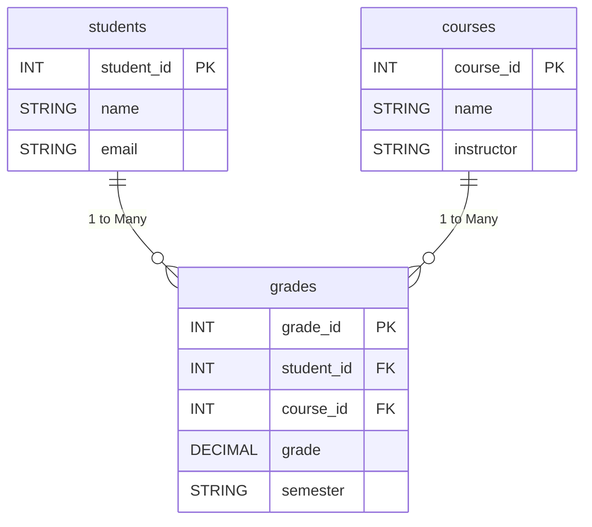

# 📚 Student Grade Tracker CLI


A command-line application to manage student grades, courses, and academic analytics using **Python** and **PostgreSQL**. Built for educators and administrators.


## ✨ Features

- 🧑🎓 **CRUD Operations**: Add/View Students, Courses, and Grades
- 📊 **Grade Analytics**: Calculate student averages and view performance trends
- 🔗 **Relational Database**: 3NF-normalized tables with foreign key constraints
- 🛡️ **Data Integrity**: Grade validation (0-100) and transaction rollbacks
- 📅 **Semester Tracking**: Organize grades by academic terms


## 🛠️ Tech Stack

- **Database**: PostgreSQL
- **Backend**: Python + `psycopg2`
- **Tools**: pgAdmin, SQL Shell


## 🚀 Installation

### Prerequisites
- PostgreSQL 15+ ([Download](https://www.postgresql.org/download/))
- Python 3.9+

### Setup
1. **Clone the repository**:
   ```bash
   git clone https://github.com/inner-byte/postgresql-student-tracker-cli.git
   cd postgresql-student-tracker-cli
   ```

2. **Create PostgreSQL Database**:
   ```bash
   psql -U postgres -c "CREATE DATABASE student_grades;"
   psql -U postgres -c "CREATE USER pg_user WITH PASSWORD 'pg_password';"
   psql -U postgres -c "GRANT ALL PRIVILEGES ON DATABASE student_grades TO pg_user;"
   ```

3. **Initialize Schema**:
   ```bash
   psql -U pg_user -d student_grades -a -f schema.sql
   ```

4. **Install Dependencies**:
   ```bash
   pip install -r requirements.txt
   ```


## 🖥️ Usage

Start the CLI:
```bash
python main.py
```

### Menu Options:
1. Add Student
2. Add Course
3. Add Grade
4. View Students
5. View Courses
6. View Grades
7. Calculate Avg
8. Exit


## 🗄️ Database Schema

```sql
CREATE TABLE students (
    student_id SERIAL PRIMARY KEY,
    name VARCHAR(100) NOT NULL,
    email VARCHAR(100) UNIQUE
);

CREATE TABLE courses (
    course_id SERIAL PRIMARY KEY,
    name VARCHAR(100) NOT NULL,
    instructor VARCHAR(100)
);

CREATE TABLE grades (
    grade_id SERIAL PRIMARY KEY,
    student_id INT REFERENCES students(student_id) ON DELETE CASCADE,
    course_id INT REFERENCES courses(course_id) ON DELETE CASCADE,
    grade DECIMAL(5,2) CHECK (grade >= 0 AND grade <= 100),
    semester VARCHAR(20)
);
```

### ER Diagram




## 🤝 Contributing

1. Fork the project.
2. Create your feature branch:
   ```bash
   git checkout -b feature/AmazingFeature
   ```
3. Commit your changes:
   ```bash
   git commit -m 'Add some AmazingFeature'
   ```
4. Push to the branch:
   ```bash
   git push origin feature/AmazingFeature
   ```
5. Open a Pull Request.


## 📜 License

Distributed under the MIT License. See LICENSE for details.

Made with ❤️ by [Ali Ahmad Sunusi] | 📧 asakrg@outlook.com

